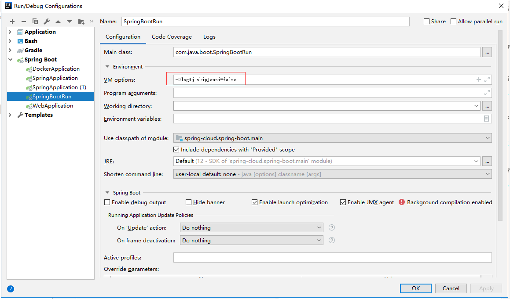
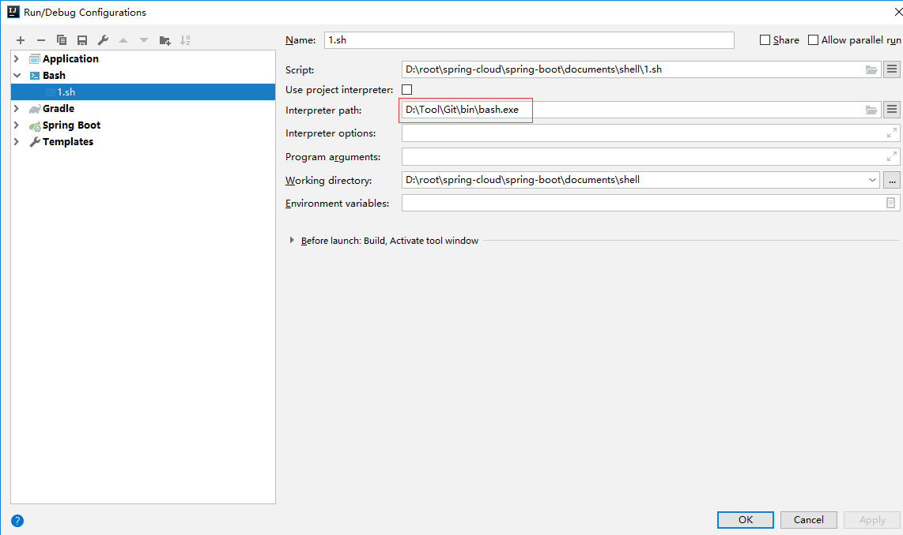

### 彩色日志打印 加虚拟机参数

    -Dlog4j.skipJansi=false
    
修改项目下 .idea\workspace.xml
    
找到标签 <component name="PropertiesComponent">。在标签里加一行  ：

<property name="dynamic.classpath" value="true" />
    

### shell 执行环境

安装 bashsupport 插件

配置 bash 环境

